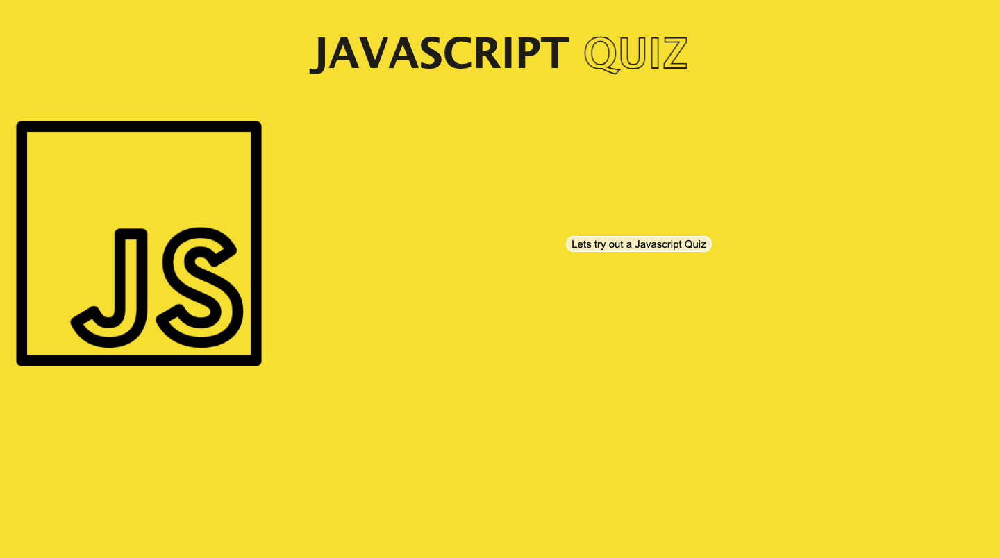

# Konnen Hannaford.  Java-Quizz

Site can be accessed here: https://konnenhannaford.github.io/Java-Quizz/
The source can be retrieved by cloning and pulling from https://github.com/konnenhannaford/Java-Quizz

# About
This page is a Javascript Quiz that tests users on their knowledge of Javascript.  

# Tools used
HTML< CSS, Javascript

# Updates
* Site has been developed to show a homepage which show sinformation about the test
* Site has been developed for buttons to progress through the site 
* Site has been developed to allower users to answer questions based on Javascript
* Site has been developed to allow users to input their scores and info
* Coding for site has been streamlined for efficiency
* A repo following best practice has been created
* A ReadMe detailing the site and its workings has been created
* Site has been deployed as a live site and applications loads with no errors

# Making Changes
Repo is public and can be updated by all via https://github.com/konnenhannaford/Java-Quizz

# Learnings and changes
Completing this has increased familiarity with the process of Javascript and its applications to a website.  It is very complex area that will require further investigation as it is essential to a large are of roles and tasks.  

# Site Screenshot

